<!-- TODO: 프로젝트명 확정되면 제목/뱃지/설명 교체 -->
<h1 align="center">Sherpa</h1>

<p align="center">
  채용 공고 및 트렌드 데이터를 활용한 이력서 인사이트 서비스
</p>

# Table of Contents
- [Introduction](#introduction)
- [Demo](#demo)
- [API](#-api)
- [System Architecture](#-system-architecture)
- [ERD](#-erd)
- [Tech Stack](#-tech-stack)
- [Monitoring](#-monitoring)
- [How to Start](#-how-to-start)
- [Member](#-member)
<br>

# Introduction
### URL
<blockquote>
Frontend: https://frontend-tan-chi-25.vercel.app
</blockquote>

<br>

# Demo

### 홈 화면
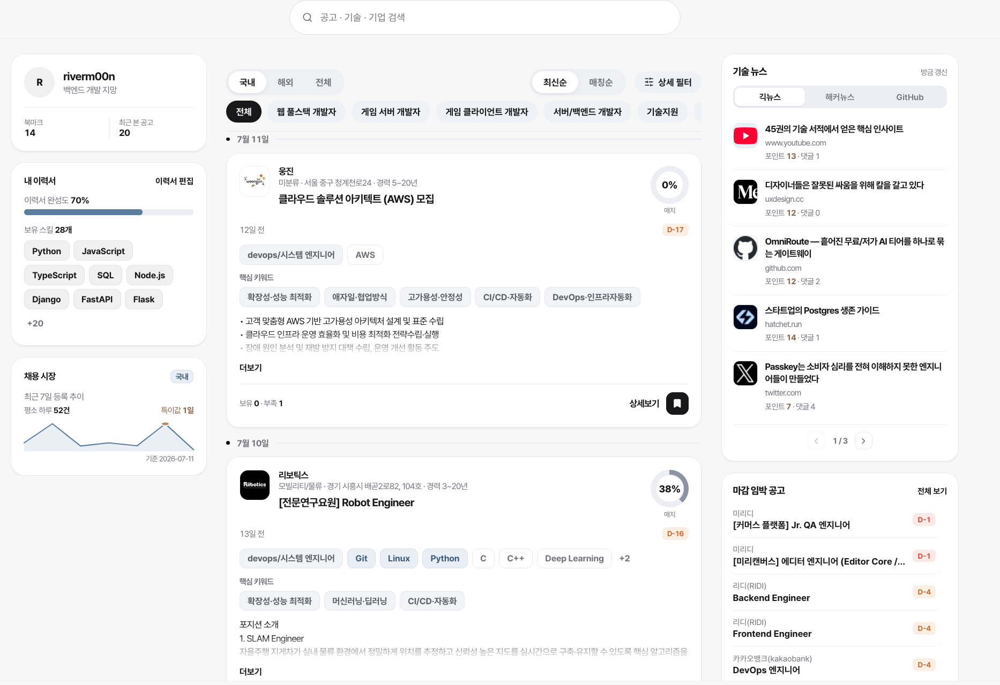
<br><br>

### 대시보드
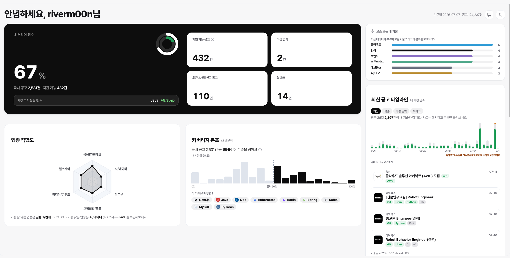
<br><br>

### 커리어 로드맵
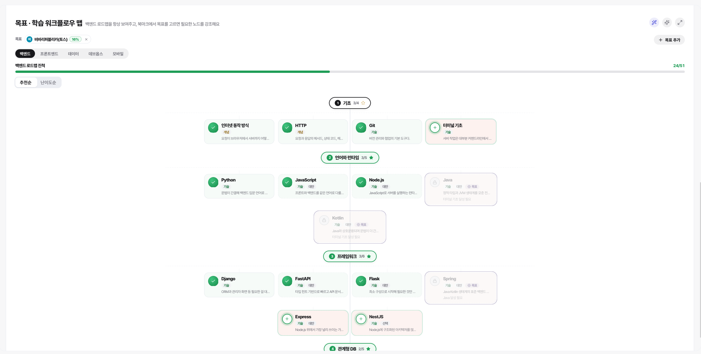
<br><br>

### 채용 시장
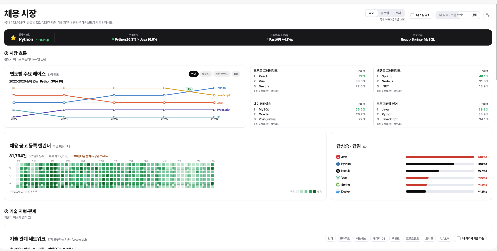
<br><br>

### AI 어시스턴트
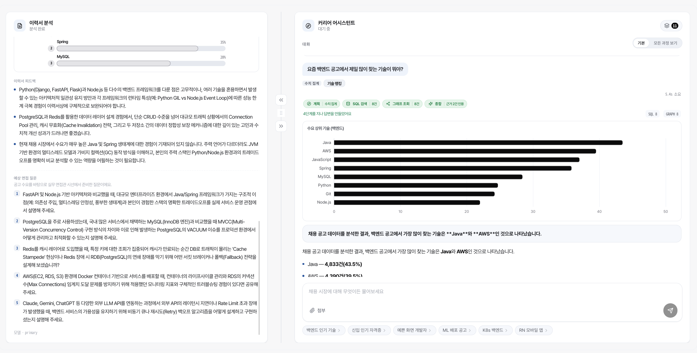
<br><br>


# 🔌 API
FastAPI 자동 생성 문서(`/docs`, Swagger UI) 기준, 테스트/디버그 전용 엔드포인트(`/test-ui`, `/easy-dash`, `/db-viewer`, `/api/db/tables*`)를 제외한 전체 엔드포인트예요.

### 시스템 (헬스체크 · 메트릭)
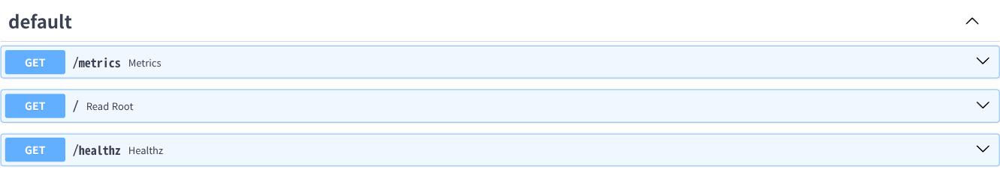
<br><br>

### 인증 (auth)
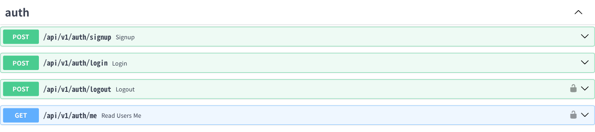
<br><br>

### 자격증 (cert)
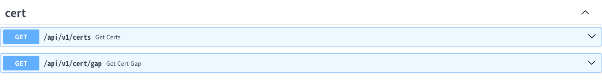
<br><br>

### 직군 카테고리 (job-categories)
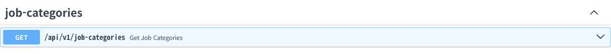
<br><br>

### 이력서 (resume)
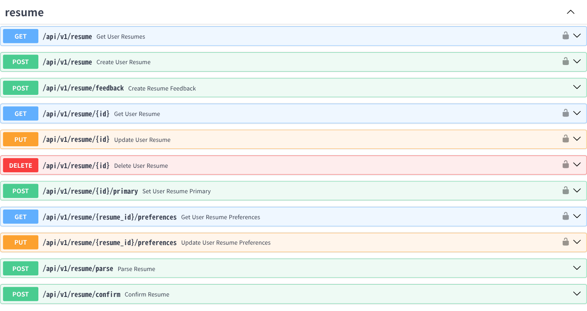
<br><br>

### 기술 (skills)
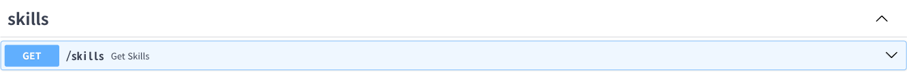
<br><br>

### 매칭 분석 (match)
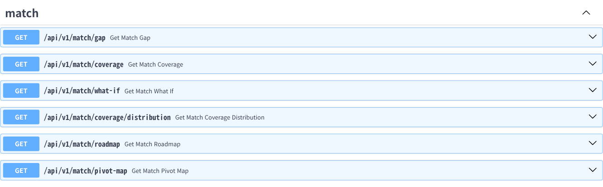
<br><br>

### 공고 지도 (posting-map)
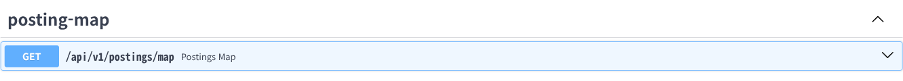
<br><br>

### 채용 공고 (postings)
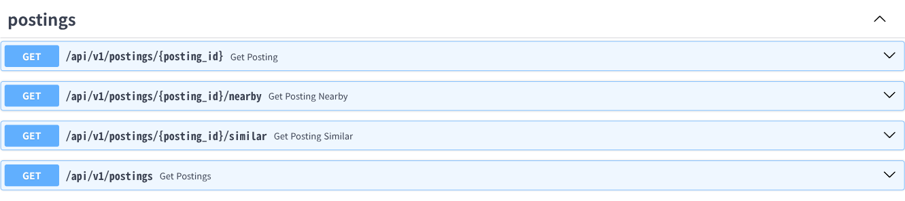
<br><br>

### 회사 (company)
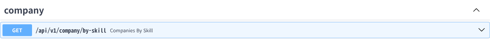
<br><br>

### 시장 인사이트 (insight)
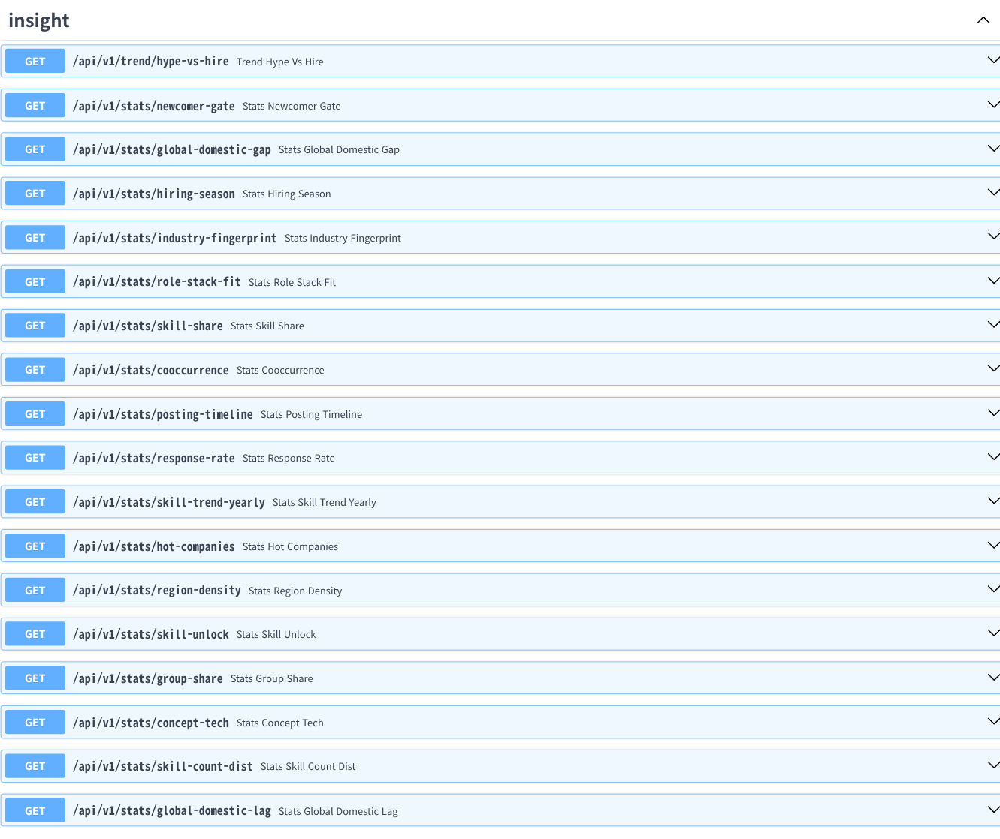
<br><br>

### GitHub 트렌드 (github-insight)
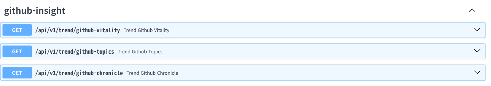
<br><br>

### 관리자 (admin)
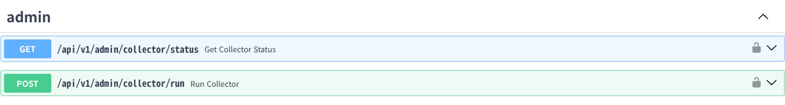
<br><br>

### 검색 (search)
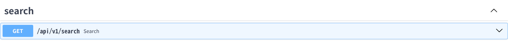
<br><br>

### AI 챗봇 (chat)
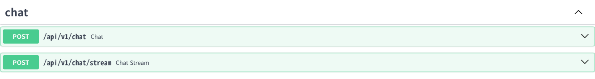
<br><br>

### 뉴스 (news)
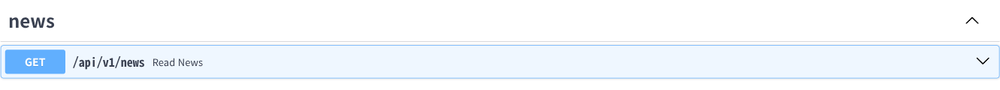
<br><br>

### 피드 (feed)
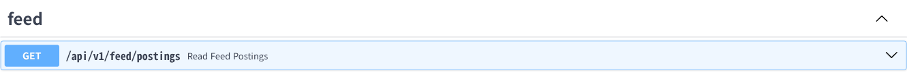
<br><br>

# 🏗 System Architecture
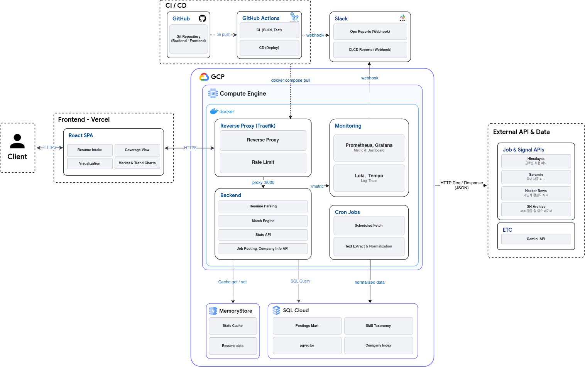
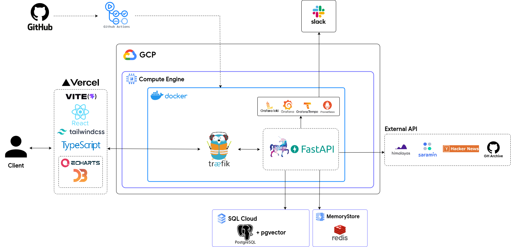
<br><br>

# 🗃 ERD
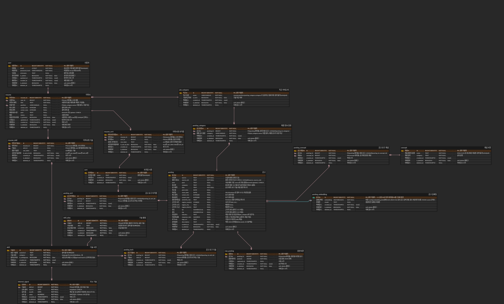
<br><br>

# 🧰 Tech Stack
<table style="width:100%; background:#ffffff; border-collapse:collapse;">
  <tr style="background:#ffffff;">
    <th align="center" style="background:#ffffff; border:1px solid #e5e7eb; padding:10px;">Field</th>
    <th align="center" style="background:#ffffff; border:1px solid #e5e7eb; padding:10px;">Technology of Use</th>
  </tr>

  <tr style="background:#ffffff;">
    <td align="center" style="background:#ffffff; border:1px solid #e5e7eb; padding:10px;"><b>Frontend</b></td>
    <td align="left" style="background:#ffffff; border:1px solid #e5e7eb; padding:10px;">
      
      
      
      
      <br/>
      
      
      
    </td>
  </tr>

  <tr style="background:#ffffff;">
    <td align="center" style="background:#ffffff; border:1px solid #e5e7eb; padding:10px;"><b>Backend</b></td>
    <td align="left" style="background:#ffffff; border:1px solid #e5e7eb; padding:10px;">
      
      
      
      <br/>
      
      
      
    </td>
  </tr>

  <tr style="background:#ffffff;">
    <td align="center" style="background:#ffffff; border:1px solid #e5e7eb; padding:10px;"><b>Database</b></td>
    <td align="left" style="background:#ffffff; border:1px solid #e5e7eb; padding:10px;">
      
      
      
    </td>
  </tr>

  <tr style="background:#ffffff;">
    <td align="center" style="background:#ffffff; border:1px solid #e5e7eb; padding:10px;"><b>AI</b></td>
    <td align="left" style="background:#ffffff; border:1px solid #e5e7eb; padding:10px;">
      
      
    </td>
  </tr>

  <tr style="background:#ffffff;">
    <td align="center" style="background:#ffffff; border:1px solid #e5e7eb; padding:10px;"><b>DevOps</b></td>
    <td align="left" style="background:#ffffff; border:1px solid #e5e7eb; padding:10px;">
      
      
      
      
      
    </td>
  </tr>

  <tr style="background:#ffffff;">
    <td align="center" style="background:#ffffff; border:1px solid #e5e7eb; padding:10px;"><b>Monitoring</b></td>
    <td align="left" style="background:#ffffff; border:1px solid #e5e7eb; padding:10px;">
      
      
      
      
      
    </td>
  </tr>

  <tr style="background:#ffffff;">
    <td align="center" style="background:#ffffff; border:1px solid #e5e7eb; padding:10px;"><b>ETC</b></td>
    <td align="left" style="background:#ffffff; border:1px solid #e5e7eb; padding:10px;">
      
      
      
      
    </td>
  </tr>
</table>
<br/>

# 📊 Monitoring
> TODO: Grafana 대시보드(FastAPI / Redis / PostgreSQL 패널) 스크린샷을 채워주세요. 로컬에서는 `docker compose up -d` 후 http://localhost:3000 에서 확인할 수 있어요.
<br>

# 🚀 How to Start
#### 1. Clone The Repository
```bash
git clone https://github.com/2026-Summer-Techeer-Bootcamp-A/backend.git
git clone https://github.com/2026-Summer-Techeer-Bootcamp-A/frontend.git
```
#### 2. ENV Setting
- `backend/.env` (`.env.example` 참고)
```bash
# Local dev convenience
COMPOSE_FILE=docker-compose.yml:docker-compose.dev.yml

# App
APP_IMAGE=career-backend:local
APP_PORT=8000
LOG_LEVEL=info
DOMAIN_NAME=your-domain.com
ACME_EMAIL=your-email@example.com

# CORS
CORS_ORIGINS=["http://localhost:3000","https://your-frontend-domain.com"]

# Database
POSTGRES_HOST=db
POSTGRES_DB=appdb_load
POSTGRES_USER=appuser
POSTGRES_PASSWORD=change-me
POSTGRES_PORT=5432
DATABASE_URL=postgresql+psycopg://appuser:change-me@db:5432/appdb_load

# Redis
REDIS_PORT=6379
REDIS_URL=redis://redis:6379/0

# Observability exporters
POSTGRES_EXPORTER_DSN=postgresql://appuser:change-me@db:5432/appdb_load?sslmode=disable
REDIS_EXPORTER_ADDR=redis://redis:6379

# Observability
GF_SECURITY_ADMIN_PASSWORD=change-me

# 외부 API
GEMINI_API_KEY=your-gemini-api-key
GEMINI_MODEL=gemini-3.5-flash-lite
```
#### 3. Run Docker (Backend + DB + Redis + Monitoring)
```bash
cd backend

# 전체 서비스 실행 (.env의 COMPOSE_FILE 설정으로 dev 오버라이드까지 함께 뜸)
docker compose up -d --build

# 종료
docker compose down
```
브라우저로 확인:
- http://localhost:8000/docs : API 문서 (Swagger UI)
- http://localhost:3000 : Grafana (admin / `.env`의 `GF_SECURITY_ADMIN_PASSWORD`)
- http://localhost:9090 : Prometheus

#### 4. Frontend
```bash
cd frontend
npm install
npm run dev
```
→ http://localhost:5173
<br>

## 👥 Member

| Name | 김강문 | 박성훈 | 방준혁 | 최혜민 | 이동건 |
|:---:|:---:|:---:|:---:|:---:|:---:|
| Profile |  |  |  |  |  |
| Role | Team Leader<br>Frontend<br>Backend<br>DevOps | Frontend<br>Backend | Frontend<br>Backend<br>DevOps | Frontend<br>Backend | Frontend<br>Backend |
| GitHub | <a href="https://github.com/rivermoon-03"></a> | <a href="https://github.com/sunghoon0303"></a> | <a href="https://github.com/whatmakesaman"></a> | <a href="https://github.com/chm9614"></a> | <a href="https://github.com/1102leedg"></a> |
